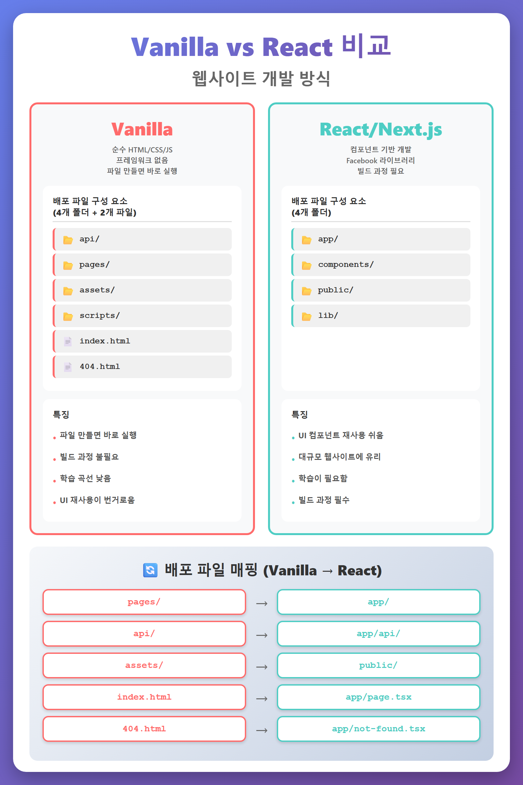

# Vanilla와 React란 무엇인가

> 웹사이트를 만드는 두 가지 방식을 이해하고, 각각의 특징과 배포 파일 구성을 알아봅니다.

---

## 비교 이미지

---

## Vanilla란 무엇인가

Vanilla는 순수하다는 뜻입니다. 바닐라 아이스크림이 아무것도 섞지 않은 기본 맛인 것처럼, Vanilla HTML/JS는 프레임워크나 라이브러리 없이 순수 웹 기술만 사용하는 방식입니다.

HTML로 화면 구조를 만들고, CSS로 꾸미고, JavaScript로 동작을 추가합니다. 별도의 설치나 빌드 과정이 없습니다. 파일을 만들면 바로 브라우저에서 열어볼 수 있습니다.

### 장점
- **간단함**: 파일 만들면 바로 실행
- **낮은 학습 곡선**: 초보자도 쉽게 시작
- **빌드 과정 불필요**: 추가 도구 설치 없음
- **즉시 확인 가능**: 브라우저에서 바로 테스트

### 단점
- **UI 재사용 번거로움**: 같은 HTML 코드 반복 작성
- **대규모 프로젝트 관리 어려움**: 파일 수 증가 시 복잡도 상승

---

## Vanilla 배포 파일 구성 요소

Vanilla 방식에서는 **4개 폴더 + 2개 파일**이 필요합니다. 이것들은 배포 플랫폼(Vercel, Netlify)이 인식하는 필수 구성 요소입니다.

### api/ 폴더 (백엔드 인터페이스)

api는 Application Programming Interface의 약자입니다. 프론트엔드와 백엔드가 대화하는 창구입니다.

Vercel에 배포하면 이 폴더 안의 JavaScript 파일들이 자동으로 API 엔드포인트가 됩니다. 별도의 서버 설정 없이 서버리스 함수로 동작합니다.

**⚠️ 폴더명 변경 금지**: Vercel이 `api`라는 이름을 인식해서 자동 처리합니다.

하위 구조 예시:
- `api/Backend_APIs/` - 회원가입, 프로젝트 관리 등 핵심 API
- `api/Security/` - 로그인, 로그아웃, 인증 관련
- `api/External/` - 외부 서비스(AI, 결제) 연동

### pages/ 폴더 (화면/페이지)

사용자가 보는 HTML 페이지들을 담습니다. 브라우저에서 직접 열리는 화면입니다.

하위 구조 예시:
- `pages/auth/` - 로그인, 회원가입, 비밀번호 찾기
- `pages/subscription/` - 구독 관리, 결제
- `pages/mypage/` - My Page, 설정

각 HTML 파일이 하나의 화면입니다. `signup.html`은 회원가입 화면, `login.html`은 로그인 화면입니다.

### assets/ 폴더 (정적 자원)

assets는 자산이라는 뜻입니다. 웹사이트를 꾸미고 동작하게 하는 정적 파일들입니다.

하위 구조 예시:
- `assets/css/` - 스타일시트 (화면 꾸미기)
- `assets/js/` - JavaScript (동작 추가)
- `assets/images/` - 이미지, 아이콘
- `assets/fonts/` - 글꼴 파일

**정적 파일이란?** 서버에서 가공 없이 그대로 전달되는 파일입니다. 한 번 만들어두면 모든 사용자에게 동일하게 제공됩니다.

### scripts/ 폴더 (자동화 도구)

scripts는 자동화 도구를 담는 폴더입니다. 배포되는 코드가 아니라 개발 과정에서 사용하는 도구입니다.

예시:
- `build-web-assets.js` - 여러 파일을 한 번에 빌드
- `generate-ordersheets-js.js` - Markdown을 JavaScript로 변환

**스크립트 저장 원칙:**
1. 단일 대상 스크립트 → 해당 폴더에 저장
2. 복수 대상 스크립트 → 루트 scripts/에 저장

### index.html (메인 페이지)

사용자가 사이트에 접속하면 가장 먼저 보는 화면입니다. 루트 디렉토리에 위치합니다.

### 404.html (에러 페이지)

존재하지 않는 주소로 접속했을 때 보여주는 화면입니다. 404는 HTTP 상태 코드로 "찾을 수 없음"을 의미합니다.

---

## React란 무엇인가

React는 Facebook(현 Meta)이 만든 JavaScript 라이브러리입니다. 화면을 컴포넌트 단위로 쪼개서 만듭니다.

컴포넌트란 헤더, 사이드바, 버튼 같은 UI 조각입니다. 한 번 만들어두면 여러 곳에서 재사용할 수 있습니다.

### 학습 요구사항
- 컴포넌트 개념 이해
- JSX 문법 습득
- 훅(Hook) 사용법 학습
- 빌드 과정 이해

### Next.js란?

Next.js는 React를 기반으로 한 프레임워크입니다. React에 다음 기능을 추가한 것입니다:
- 라우팅 (페이지 이동)
- 서버사이드 렌더링 (SSR)
- 이미지 최적화
- API 라우트

### 장점
- **UI 재사용 용이**: 컴포넌트 한 번 작성, 여러 곳에서 사용
- **대규모 프로젝트 관리**: 구조화된 개발 가능
- **풍부한 생태계**: 다양한 라이브러리와 도구

### 단점
- **학습 필요**: React, JSX, 훅 등 개념 습득 필요
- **빌드 필수**: 코드 작성 후 변환 과정 필요
- **복잡도 증가**: 단순한 사이트에는 과할 수 있음

---

## React/Next.js 배포 파일 구성 요소

React(Next.js) 방식에서는 **4개 폴더**만 있으면 됩니다. 루트 레벨 파일이 없어 더 깔끔합니다.

### app/ 폴더 (애플리케이션 핵심)

Next.js 13부터 도입된 App Router 방식의 핵심 폴더입니다. 페이지, API, 레이아웃이 모두 여기 들어갑니다.

**Vanilla와의 차이점:**
| Vanilla | React/Next.js |
|---------|---------------|
| `index.html` | `app/page.tsx` |
| `404.html` | `app/not-found.tsx` |
| `pages/auth/login.html` | `app/auth/login/page.tsx` |

폴더가 URL 경로가 됩니다. `app/auth/login/page.tsx`는 `/auth/login` URL이 됩니다.

하위 구조 예시:
- `app/page.tsx` - 메인 페이지
- `app/auth/login/page.tsx` - 로그인 페이지
- `app/api/` - API 라우트 (Vanilla의 api 폴더와 유사)
- `app/layout.tsx` - 공통 레이아웃 (헤더, 푸터 등)

### components/ 폴더 (재사용 UI 조각)

컴포넌트는 UI를 작은 조각으로 나눈 것입니다. 한 번 만들어두면 여러 페이지에서 재사용할 수 있습니다.

하위 구조 예시:
- `components/Header.tsx` - 상단 네비게이션
- `components/Sidebar.tsx` - 좌측 메뉴
- `components/Modal.tsx` - 팝업 창
- `components/Button.tsx` - 버튼

**Vanilla와의 차이:**
- Vanilla: 같은 HTML을 여러 파일에 복사
- React: 컴포넌트를 import해서 재사용

### public/ 폴더 (정적 자원)

Vanilla의 `assets/` 폴더와 같은 역할입니다. 이미지, 폰트, 아이콘 같은 정적 파일을 담습니다.

하위 구조 예시:
- `public/images/` - 이미지 파일
- `public/fonts/` - 글꼴 파일
- `public/favicon.ico` - 브라우저 탭 아이콘

**접근 방법:** `public/images/logo.png`는 `/images/logo.png`로 접근합니다.

### lib/ 폴더 (유틸리티와 설정)

lib는 library의 줄임말입니다. 여러 곳에서 공통으로 사용하는 유틸리티와 설정을 담습니다.

하위 구조 예시:
- `lib/supabase.ts` - Supabase 클라이언트 설정
- `lib/utils.ts` - 공통 유틸리티 함수
- `lib/api-client.ts` - API 호출 함수

**Vanilla와의 차이:**
- Vanilla: 각 파일에서 직접 설정 작성
- React: lib에 한 번 작성하고 import해서 사용

---

## Vanilla ↔ React 배포 파일 매핑

| Vanilla | React/Next.js | 설명 |
|---------|---------------|------|
| `pages/` | `app/` | 화면 페이지 |
| `api/` | `app/api/` | API 엔드포인트 |
| `assets/` | `public/` | 정적 자원 (이미지, 폰트 등) |
| `index.html` | `app/page.tsx` | 메인 페이지 |
| `404.html` | `app/not-found.tsx` | 에러 페이지 |
| (없음) | `components/` | 재사용 UI 컴포넌트 |
| (없음) | `lib/` | 공통 유틸리티 |

---

## 어떤 방식을 선택할까?

프로젝트의 목적과 규모에 맞는 방식을 선택하세요.

### Vanilla를 선택하는 경우
- 단순한 웹사이트 (5-10페이지 이하)
- 빠른 프로토타입 제작
- React 학습 전 웹 기초 학습
- 빌드 과정 없이 즉시 배포

### React를 선택하는 경우
- 복잡한 상호작용이 많은 웹사이트
- 대규모 프로젝트 (20페이지 이상)
- UI 컴포넌트 재사용이 많은 경우
- 팀 협업 개발

---

## SSALWorks에서는?

SSALWorks는 현재 Vanilla를 사용합니다. 프로젝트 특성상 Vanilla로 충분하기 때문입니다.

Vanilla든 React든 도구일 뿐입니다. 중요한 것은 프로젝트를 완성하는 것입니다. SAL Grid로 작업 순서를 관리하고, 폴더 규칙으로 파일을 정리하고, 검증 프로세스로 품질을 확인합니다.

---

**다음 편:** Vanilla에서 React로 전환하는 경우
**참고:** `Human_ClaudeCode_Bridge/Reports/Folder_Structure_Comparison.md`
