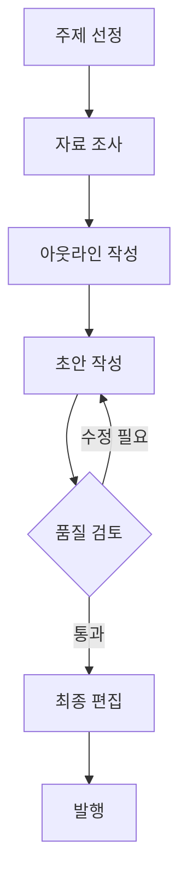
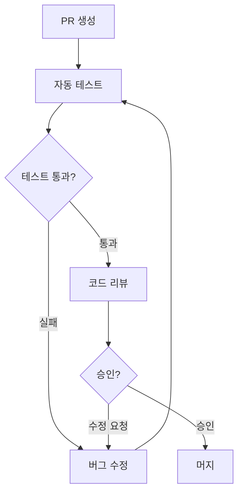

# 31편 | 물리적 작업환경 최적화

---

Claude를 단순히 웹 브라우저 채팅창에서만 사용하는 사람이 많다. 하지만 모니터 배치, 여러 Claude 버전의 동시 활용, 프롬프트/워크플로우 라이브러리 구축 등 물리적 환경을 최적화하면 생산성이 크게 향상된다. 이 편에서는 Claude와 함께 일하는 물리적 작업 환경을 최적화하는 방법을 다룬다.

## 1. 물리적 작업환경 설정

### 1-1 모니터 구성

세로형 모니터와 가로형 모니터를 함께 사용하면 효율이 높아진다.

**권장 배치:**
```
[세로 모니터]          [가로 모니터]
┌─────────┐    ┌───────────────────┐
│         │    │  Claude 데스크톱   │
│ Claude  │    │  ┌─────┬─────┐   │
│  Code   │    │  │채팅 │아티팩│   │
│ 터미널  │    │  │     │트    │   │
│         │    │  └─────┴─────┘   │
│ (코드/  │    │                   │
│  로그)  │    │  또는 VS Code     │
└─────────┘    └───────────────────┘
         [모바일: 음성 대화용]
```

**세로 모니터 용도:**
- Claude Code CLI 터미널 전체 화면
- 긴 코드나 로그를 스크롤 없이 확인
- 파일 트리 + 코드 동시 보기

**가로 모니터 용도:**
- Claude 데스크톱: 채팅창 + 아티팩트 나란히
- VS Code: 편집기 + 터미널 + 사이드바

**모바일 디바이스:**
- 모니터 앞쪽에 배치
- Claude 모바일 앱 음성 대화 전용
- 키보드 없이 브레인스토밍

### 1-2 5개 Claude 동시 운영

복잡한 프로젝트에서 5개 Claude를 동시에 운영하면 병렬 작업이 가능하다.

**구성:**

| 위치 | Claude 버전 | 역할 |
|------|------------|------|
| 왼쪽 모니터 | Claude Code (터미널) | 새 코드/문서 생성 |
| 중앙 하단 | Claude Code (VS Code 내) | 실시간 수정/디버깅 |
| 중앙 오른쪽 | Claude 데스크톱 (VS Code 내) | 코드 검토/문서화 |
| 오른쪽 | Claude 데스크톱 (단독) | 웹 검색/자료 조사 |
| 아래 | Claude 모바일 | 음성 브레인스토밍 |

**병렬 작업 예시:**
```
Claude 1: 새 API 코드 작성 중
Claude 2: 기존 코드 버그 수정 중
Claude 3: 작성된 코드 리뷰 중
Claude 4: 관련 문서 검색 중
Claude 5: 다음 기능 아이디어 정리 중
```

5개가 동시에 작업하므로 한 Claude가 응답을 생성하는 동안 다른 작업을 진행할 수 있다.

### 1-3 4단계 작업 프로세스

각 Claude 버전의 강점을 단계별로 활용한다.

```
[1단계: 모바일]
이동 중 음성으로 아이디어 브레인스토밍
    ↓
[2단계: 데스크톱]
MCP로 파일 접근, 상세 기획서 작성
    ↓
[3단계: Claude Code]
대용량 코드 생성, 자동화 스크립트
    ↓
[4단계: VS Code]
최종 편집, 통합, 디버깅
```

**단계별 상세:**

| 단계 | 도구 | 작업 내용 |
|------|------|----------|
| 1단계 | 모바일 앱 | 출퇴근길 음성 브레인스토밍, 아이디어 정리 |
| 2단계 | 데스크톱 | Filesystem/Memory MCP 활용, 기획서 작성 |
| 3단계 | Claude Code | 무거운 작업 (코드 생성, 데이터 처리) |
| 4단계 | VS Code | Claude와 함께 최종 편집, 리뷰, 최적화 |

## 2. 프롬프트 라이브러리 구축

### 2-1 왜 라이브러리가 필요한가

매번 프롬프트를 새로 작성하면 시간이 낭비되고 품질이 들쭉날쭉하다.

**라이브러리 장점:**
- 검증된 템플릿 재사용
- 일관된 품질
- 시간 절약
- 지속적 개선 가능

### 2-2 폴더 구조

```
Prompts/
├── Development/
│   ├── code-review.md
│   ├── bug-fix.md
│   ├── refactoring.md
│   └── test-writing.md
│
├── Writing/
│   ├── blog-post.md
│   ├── technical-doc.md
│   ├── email-draft.md
│   └── report.md
│
├── Analysis/
│   ├── data-analysis.md
│   ├── competitor-analysis.md
│   └── market-research.md
│
├── Business/
│   ├── proposal.md
│   ├── presentation.md
│   └── meeting-summary.md
│
└── index.json          ← 검색용 인덱스
```

### 2-3 템플릿 작성 규칙

**필수 요소:**

```markdown
# [템플릿 이름]

## 용도
[이 프롬프트를 사용하는 상황]

## 프롬프트
---
당신은 [역할]입니다.

[구체적 요구사항]

[제약조건]

[출력 형식]
---

## 예상 결과
[어떤 결과가 나오는지]

## 성공 사례
[잘 작동한 예시]

## 태그
[검색용 키워드]
```

**예시 - 코드 리뷰 템플릿:**

```markdown
# 코드 리뷰 템플릿

## 용도
PR 코드 리뷰, 품질 검토

## 프롬프트
---
당신은 시니어 개발자입니다.

다음 코드를 리뷰해주세요:
- 버그 가능성
- 성능 이슈
- 보안 취약점
- 가독성/유지보수성
- 개선 제안

출력 형식:
1. 요약 (한 줄)
2. 주요 이슈 (심각도별)
3. 개선 제안 (코드 포함)
---

## 태그
code, review, quality, pr
```

### 2-4 인덱스 관리

`index.json`으로 빠른 검색을 지원한다.

```json
{
  "templates": [
    {
      "name": "code-review",
      "path": "Development/code-review.md",
      "tags": ["code", "review", "quality"],
      "category": "Development",
      "usage_count": 47,
      "last_used": "2025-12-20"
    },
    {
      "name": "blog-post",
      "path": "Writing/blog-post.md",
      "tags": ["writing", "blog", "content"],
      "category": "Writing",
      "usage_count": 23,
      "last_used": "2025-12-19"
    }
  ]
}
```

**활용:**
- 태그로 검색
- 사용 빈도 순 정렬
- 최근 사용 템플릿 빠른 접근

## 3. 워크플로우 라이브러리

### 3-1 워크플로우란

복잡한 작업을 단계별로 정리한 프로세스 다이어그램이다.

**장점:**
- 전체 프로세스를 한눈에 파악
- 병목 지점 식별
- 팀원과 공유 용이
- 반복 작업 표준화

### 3-2 Mermaid로 워크플로우 작성

마크다운 기반으로 다이어그램을 그릴 수 있다.

**예시 - 블로그 글 작성 워크플로우:**



**예시 - 코드 리뷰 워크플로우:**



### 3-3 워크플로우 템플릿 저장

```
Workflows/
├── Development/
│   ├── code-review-flow.md
│   ├── bug-fix-flow.md
│   └── feature-dev-flow.md
│
├── Content/
│   ├── blog-writing-flow.md
│   ├── video-production-flow.md
│   └── newsletter-flow.md
│
└── Business/
    ├── proposal-flow.md
    ├── meeting-flow.md
    └── report-flow.md
```

## 4. 폴더 구조 설계

### 4-1 3대 분류 체계

작업 성격에 따라 최상위 폴더를 분류한다.

```
Work/
├── Development/      ← 개발 프로젝트
├── Content/          ← 콘텐츠 제작
└── Business/         ← 업무 문서
```

**Development 구조:**
```
Development/
├── project-a/
│   ├── src/
│   ├── tests/
│   ├── docs/
│   └── .context.md
├── project-b/
└── templates/        ← 코드 템플릿
```

**Content 구조:**
```
Content/
├── drafts/           ← 초안
├── research/         ← 리서치 자료
├── templates/        ← 글쓰기 템플릿
└── published/        ← 완성본
```

**Business 구조:**
```
Business/
├── reports/
├── presentations/
├── data-analysis/
└── meetings/
```

### 4-2 프로젝트별 설정 파일

각 폴더에 맞춤 설정 파일을 배치한다.

**필수 파일:**

| 파일 | 용도 |
|------|------|
| `.context.md` | 프로젝트 배경, 목표, 기술 스택 |
| `.prompts.md` | 프로젝트 전용 프롬프트 |
| `README.md` | 폴더 구조 설명 |

**.context.md 예시:**

```markdown
# 프로젝트 컨텍스트

## 프로젝트명
SSALWorks 구독 서비스

## 목표
1인 창업자를 위한 AI 기반 구독 서비스

## 기술 스택
- Frontend: HTML, CSS, JavaScript
- Backend: Vercel Serverless
- Database: Supabase
- Auth: Supabase Auth

## 코딩 컨벤션
- 파일명: kebab-case
- 변수명: camelCase
- 들여쓰기: 2 spaces
```

Claude가 이 파일을 읽으면 프로젝트 맥락을 바로 이해한다.

### 4-3 클라우드 동기화

작업 폴더를 클라우드에 동기화하면 여러 이점이 있다.

**장점:**
- 장소에 구애받지 않고 작업
- 자동 백업
- 실수로 삭제해도 복구 가능 (30일)

**설정 방법:**
```
1. Google Drive 또는 OneDrive 설치
2. Work 폴더를 클라우드 폴더 안에 배치
3. 자동 동기화 확인
```

**제외할 파일 (.cloudignore):**
```
node_modules/
.git/
*.log
*.tmp
dist/
build/
```

## 5. 팀 협업 환경

### 5-1 VS Code Live Share

여러 사람이 동시에 같은 코드를 편집할 수 있다.

**기능:**
- 실시간 공동 편집
- 터미널 공유
- 각 참여자 커서 위치 표시
- 읽기 전용/편집 권한 설정

**활용 시나리오:**
```
[페어 프로그래밍]
개발자 A: 코드 작성
개발자 B: 실시간 리뷰 및 제안
Claude Code: 둘 다 사용 가능
```

### 5-2 Settings Sync

VS Code 설정을 클라우드로 동기화한다.

**동기화 항목:**
- 설치한 확장 프로그램
- 색상 테마
- 단축키 설정
- 사용자 설정

**설정:**
```
1. VS Code > Settings > Turn on Settings Sync
2. GitHub 또는 Microsoft 계정 로그인
3. 동기화할 항목 선택
```

어느 컴퓨터에서든 동일한 개발 환경으로 작업 가능.

## 6. 정리

### 환경 최적화 체크리스트

```
물리적 환경:
□ 세로 모니터 (Claude Code용)
□ 가로 모니터 (Claude 데스크톱/VS Code용)
□ 모바일 (음성 대화용)

프롬프트 라이브러리:
□ 카테고리별 폴더 구조
□ 템플릿 파일 작성
□ index.json 인덱스

워크플로우 라이브러리:
□ 주요 작업별 워크플로우
□ Mermaid 다이어그램

폴더 구조:
□ 3대 분류 (Dev/Content/Business)
□ .context.md 파일
□ 클라우드 동기화

팀 협업:
□ VS Code Live Share
□ Settings Sync
```

### 핵심 요약

| 영역 | 핵심 |
|------|------|
| 물리 환경 | 세로+가로 모니터, 5개 Claude |
| 프롬프트 | 검증된 템플릿 재사용 |
| 워크플로우 | 프로세스 표준화 |
| 폴더 구조 | 3대 분류 + .context.md |
| 협업 | Live Share + Settings Sync |

---

**작성일: 2025-12-22 / 글자수: 약 5,500자 / 작성자: Claude / 프롬프터: 써니**

