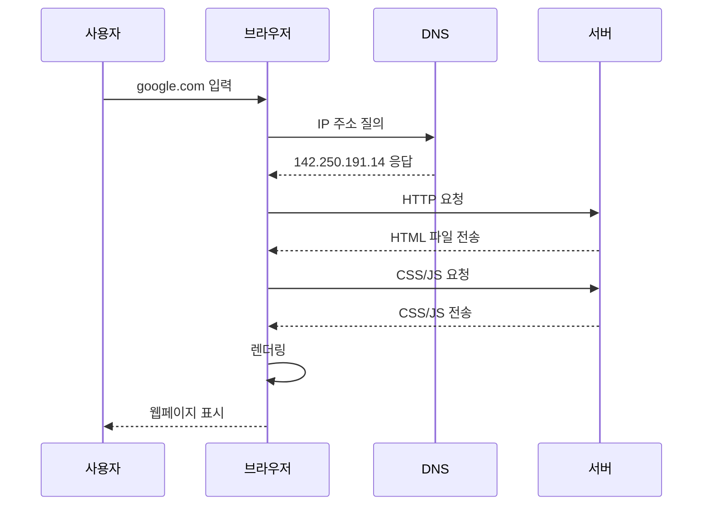

# 2편 | 웹사이트가 작동하는 원리와 구조

---

1편에서 웹개발의 핵심 개념과 용어를 정리한 다음, 이번에는 웹사이트가 실제로 어떻게 작동하는지 알아볼 차례입니다. 이번 편에서는 브라우저가 웹페이지를 보여주는 과정, 클라이언트와 서버의 통신, HTTP 프로토콜, 그리고 웹사이트의 기본 구성 요소들을 다룹니다. 주소창에 URL을 입력했을 때 일어나는 일들과 웹사이트가 화면에 나타나기까지의 전체 과정을 살펴봅니다.

## 1. 브라우저가 웹페이지를 보여주는 과정

### 1-1 웹사이트 접속의 흥미로운 여행

우리가 주소창에 "google.com"을 입력하고 엔터를 누르는 순간부터 구글 홈페이지가 화면에 나타나기까지, 단 몇 초 사이에 엄청나게 복잡한 과정이 일어납니다.

### 1-2 웹사이트가 화면에 나타나는 5단계 과정

**1단계: 주소 해석 (DNS 조회)**
- 브라우저가 "google.com이 어디에 있는지" 인터넷에 질의함
- 여러 **DNS**(Domain Name System, 도메인 이름을 IP 주소로 변환하는 시스템) 서버를 거쳐 최종적으로 "구글은 142.250.191.14 주소에 있습니다"라고 찾아냄
- 마치 스마트폰 연락처에서 "엄마"를 터치하면 여러 단계를 거쳐 전화번호를 찾아 연결하는 것과 같음

**2단계: 서버 연결**
- 브라우저가 구글 서버에 "안녕하세요, 홈페이지 주세요"라고 요청
- 이때 **HTTP**(HyperText Transfer Protocol, 웹에서 데이터를 주고받는 규약) 또는 **HTTPS**(HTTP + 보안) 프로토콜을 사용
- 서버가 "네, 잠깐만요"라고 응답하며 연결 확립

**3단계: 파일 전송**
- 서버가 HTML 파일을 브라우저에 전송
- HTML 파일 안에 "이미지도 필요합니다", "CSS 파일도 필요합니다"라는 지시사항 발견
- 브라우저가 추가로 CSS, JavaScript, 이미지 파일들을 요청

**4단계: 렌더링 (화면 그리기)**
- **렌더링**: 브라우저가 받은 파일들을 실제 웹페이지로 변환하는 자동 처리 과정
- 브라우저 내부에서 HTML을 해석하여 **DOM**(Document Object Model, 웹페이지의 구조를 나타내는 객체 모델)을 자동으로 생성
- 동시에 CSS를 해석하여 **CSSOM**(CSS Object Model, 스타일 정보를 나타내는 객체 모델)을 자동으로 생성
- 브라우저가 두 정보를 합쳐서 최종 화면 모습 계산
- JavaScript가 있으면 추가로 실행하여 동적 기능이 작동

**5단계: 완성**
- 우리가 보는 완성된 웹페이지가 화면에 나타남
- 이 모든 과정이 보통 1-3초 안에 완료됨



### 1-3 실생활 비유: 피자 전화 주문 과정

피자 전화 주문이 웹사이트 접속과 똑같습니다:

| 피자 주문 과정 | 웹사이트 접속 과정 |
|---------------|-------------------|
| 전화번호부에서 "피자헛" 검색 | DNS 조회 |
| 피자헛 매장에 전화 연결 | 서버 연결 |
| "마르게리타 피자 하나요" 주문 | HTTP 요청 |
| 매장에서 피자 제작 시작 | 서버 처리 |
| 배달원이 완성된 피자 배달 | 파일 전송 |
| 고객이 맛있게 피자 먹음 | 웹페이지 완성 |

## 2. HTML, CSS, JavaScript의 역할과 관계

### 2-1 웹사이트를 구성하는 3대 요소

웹사이트는 마치 사람과 같습니다. 신체구조가 있고, 외모가 있고, 행동이 있죠.

### 2-2 HTML: 웹사이트의 신체구조

**역할**: 웹페이지의 구조와 내용을 정의

**비유**: 사람의 머리, 몸통, 팔다리 등 기본 신체구조

**구체적 역할**: **머리(제목)**, **몸통(내용)**, **팔다리(링크)** 구성

**HTML 코드 예시:**
```html
<h1>회사 소개</h1>
<p>안녕하세요.</p>

<button>문의하기</button>
```

### 2-3 CSS: 웹사이트의 외모

**역할**: 웹페이지를 예쁘게 꾸미는 디자인 담당

**비유**: 사람의 헤어스타일, 화장, 옷, 액세서리

**CSS가 하는 일:** "제목은 파란색으로, 버튼은 빨간 배경에 둥글게"처럼 스타일 지정

> **SSALWorks에서는 Tailwind CSS**를 사용합니다. CSS를 직접 작성할 필요 없이, **Claude Code가 자동으로 스타일을 적용**해줍니다.

### 2-4 JavaScript: 웹사이트의 행동

**역할**: 웹페이지에 동작과 상호작용을 추가

**비유**: 사람의 말하기, 걷기, 생각하기, 반응하기

**JavaScript가 하는 일:** "버튼을 클릭하면 안녕하세요 메시지를 보여줘"처럼 동작 지정

> **Claude Code가 JavaScript를 자동으로 작성**해줍니다. 여러분은 "로그인 버튼 클릭하면 홈으로 이동" 같은 기능만 요청하면 됩니다.

### 2-5 3요소의 협력 관계

1. **HTML 단독**: 구조만 있는 밋밋한 문서 (흑백 텍스트)
2. **HTML + CSS**: 예쁘게 꾸며진 정적인 웹페이지 (컬러 잡지)
3. **HTML + CSS + JavaScript**: 상호작용 가능한 완전한 웹사이트 (스마트폰 앱)

## 3. 클라이언트와 서버의 대화 방식

### 3-1 인터넷은 거대한 대화의 장

웹사이트 이용은 본질적으로 **클라이언트와 서버 간의 대화**입니다.

**클라이언트 vs 서버**
- **클라이언트**: 서비스를 요청하는 쪽 (우리의 웹 브라우저)
- **서버**: 서비스를 제공하는 쪽 (웹사이트 파일들이 저장된 컴퓨터)

### 3-2 HTTP(하이퍼텍스트 전송 프로토콜)/HTTPS(보안 하이퍼텍스트 전송 프로토콜) 프로토콜: 대화의 규칙

**HTTP(하이퍼텍스트 전송 프로토콜; HyperText Transfer Protocol)**: 클라이언트와 서버가 대화할 때 사용하는 "언어"

**HTTPS(보안 하이퍼텍스트 전송 프로토콜; HyperText Transfer Protocol Secure) (보안이 핵심)**:
- HTTP(하이퍼텍스트 전송 프로토콜)에 **SSL(보안 소켓 계층; Secure Sockets Layer)**/**TLS(전송 계층 보안; Transport Layer Security)** 보안 기능 추가
- 주소창에 자물쇠 표시
- **중요성**: 모든 데이터가 암호화되어 해킹 방지
- **신뢰도**: 사용자가 안심하고 서비스 이용 가능
- **검색 순위**: 구글이 HTTPS(보안 하이퍼텍스트 전송 프로토콜) 사이트를 더 높게 평가

### 3-3 다양한 요청 유형

- **GET(가져오기)**: "정보 주세요" (웹페이지 보기, 검색)
- **POST(게시)**: "정보 저장해주세요" (회원가입, 글쓰기)
- **PUT(넣기)**: "정보 수정해주세요" (프로필 변경)
- **DELETE(삭제)**: "정보 삭제해주세요" (글 삭제)

## 4. 웹사이트 폴더와 파일 구조

### 4-1 웹사이트도 컴퓨터 폴더처럼 정리되어 있다

우리가 컴퓨터에서 문서를 폴더별로 정리하듯이, 웹사이트도 체계적으로 파일들이 정리되어 있습니다.

### 4-2 기본적인 웹사이트 폴더 구조

```
mywebsite/
├── index.html          (메인 홈페이지)
├── about.html           (회사소개 페이지)
├── contact.html         (연락처 페이지)
├── css/
│   └── style.css        (디자인 파일)
├── js/
│   └── script.js        (기능 파일)
├── images/
│   ├── logo.png         (회사 로고)
│   └── banner.jpg       (메인 배너)
└── documents/
    └── company-profile.pdf (회사소개서)
```

### 4-3 각 파일과 폴더의 역할

**주요 파일들:**
- **index.html**: 웹사이트의 "현관문" 역할, 주소에 파일명을 안 써도 자동으로 표시
- **about.html, contact.html**: 각각 회사소개, 연락처 등 개별 페이지들

**폴더별 역할:**
- **css 폴더**: 모든 디자인 관련 파일들 (폰트, 색상, 레이아웃 등)
- **js 폴더**: JavaScript 파일들 (버튼 클릭, 폼 검증 등 동작 기능)
- **images 폴더**: 웹사이트에 사용되는 모든 이미지 파일들
- **documents 폴더**: PDF, 문서 등 다운로드 가능한 자료들

### 4-4 웹브라우저가 파일을 찾는 방식

웹브라우저는 주소창의 주소를 보고 서버에서 정확한 파일을 찾아옵니다:

- `mycompany.com/about.html` 입력 → 서버의 `about.html` 파일을 가져옴
- `mycompany.com/css/style.css` 요청 → 서버의 `css/style.css` 파일을 가져옴
- `mycompany.com/images/logo.png` 요청 → 서버의 `images/logo.png` 파일을 가져옴

파일이 없으면 "**404 에러**(페이지를 찾을 수 없다는 HTTP(하이퍼텍스트 전송 프로토콜) 상태 코드)" 메시지가 발생합니다.

### 4-5 파일 관리 실전 팁

**파일명 작성 규칙:**
- 영어 소문자 사용: `about.html` ✅ `About.html` ❌
- 공백 대신 하이픈: `company-info.html` ✅ `company info.html` ❌
- 특수문자 금지: `contact.html` ✅ `연락처.html` ❌

**이미지 파일 최적화:**
- **WebP(웹피; 구글이 개발한 차세대 이미지 형식)** 형식 사용하면 용량 50% 절약
- 파일명에 크기 표시: `logo-200x100.png`, `banner-1920x600.jpg`
- 웹용 이미지는 보통 100KB 이하로 유지

**폴더 구조 실무 활용:**
- **assets/ 폴더**: 모든 자원(이미지, 폰트, 아이콘 등)을 통합 관리
- **src/ 폴더**: 개발 중인 원본 소스코드 파일들 보관
- **dist/ 폴더**: 실제 웹사이트에 올릴 배포용 최종 파일들 저장
- **backup/ 폴더**: 이전 버전 파일들을 안전하게 보관

## 5. 정적 사이트 vs 동적 사이트 차이점

### 5-1 웹사이트의 두 가지 성격

모든 웹사이트는 크게 **정적 사이트**와 **동적 사이트**로 나뉩니다.

### 5-2 정적 사이트 (Static Website)

**정의**: 미리 만들어진 HTML 파일들을 그대로 보여주는 웹사이트

**비유**: 인쇄된 브로셔나 카탈로그 같은 것

**특징**: 모든 사용자에게 동일한 내용 표시

**장점:**
- **빠른 속도**: 서버에서 파일만 전송하면 되므로 매우 빠름
- **안정성**: 서버 에러가 거의 발생하지 않음
- **저렴한 비용**: 간단한 호스팅으로 충분
- **보안성**: 해킹 당할 요소가 적음

**단점:**
- **내용 변경 어려움**: 수정하려면 HTML 파일을 직접 편집해야 함
- **상호작용 제한**: 사용자별 다른 내용 제공 불가
- **기능 한계**: 로그인, 댓글, 검색 등 복잡한 기능 구현 어려움

### 5-3 동적 사이트 (Dynamic Website)

**정의**: 사용자 요청에 따라 서버에서 실시간으로 웹페이지를 생성하는 웹사이트

**비유**: 주문에 따라 요리를 만들어주는 레스토랑

**특징**: 사용자별, 상황별로 다른 내용 표시

**장점:**
- **개인화 가능**: 사용자별로 다른 콘텐츠 제공
- **실시간 업데이트**: 데이터가 실시간으로 반영됨
- **상호작용**: 댓글, 좋아요, 검색 등 다양한 기능
- **관리 편의성**: 관리자 페이지에서 쉽게 내용 수정

**단점:**
- **느린 속도**: 매번 서버에서 페이지를 생성해야 하므로 상대적으로 느림
- **복잡성**: 개발과 유지보수가 복잡함
- **높은 비용**: 강력한 서버와 데이터베이스 필요
- **보안 이슈**: 해킹 위험이 상대적으로 높음

### 5-4 선택 기준

**정적 사이트가 적합한 경우:**
- 회사 소개, 제품 카탈로그 등 정보 제공이 주목적
- 자주 변경되지 않는 내용
- 빠른 속도와 안정성이 중요
- 예산이 제한적

**동적 사이트가 필요한 경우:**
- 사용자 등록, 로그인 기능 필요
- 개인별 맞춤 서비스 제공
- 실시간 데이터 처리 (주문, 결제, 소통 등)
- 플랫폼으로 확장할 계획

---

**작성일: 2025-09-01 / 수정일: 2025-12-20 / 글자수: 약 5,600자 / 작성자: Claude / 프롬프터: 써니**
